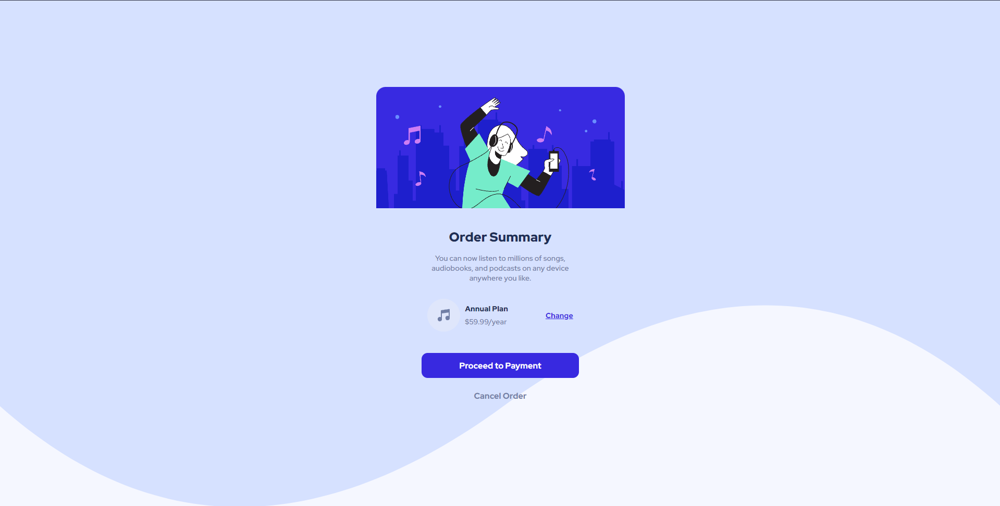
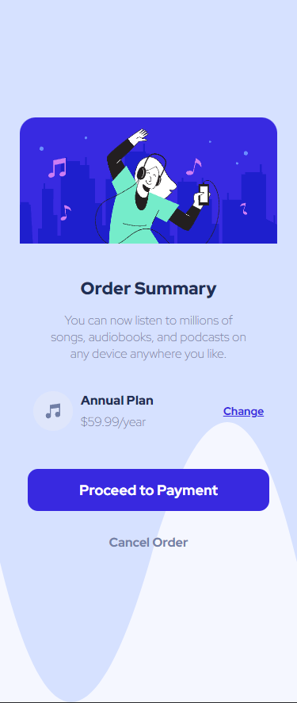

# Português (pt-BR)

# Frontend Mentor - Projeto de um QR Code

Essa é a resolução do projeto [Order-summary-component-main] (https://www.frontendmentor.io/challenges/order-summary-component-QlPmajDUj/hub). O Frontend Mentor ajuda a melhorar nossas capacidades de codificação pois criamos projetos reais. 🚀

## Desafio

- Os usuários devem ver o layout do projeto que é uma área onde ele descide se quer ou não fazer a assinatura de um plano anual.

## Screenshots

### Desktop

### Mobile

## Links

- Site: https://www.frontendmentor.io/

## Processo

### Construído com

- Semantic HTML5 markup
- CSS custom properties
- Flexbox

### O que aprendi

Aprendi como usar algumas das tags semânticas do HTML5. Foi aprendido também como estilizar elementos com o CSS, usando formas como o display:flex, além de uma media-querie para fazer a versão mobile.

### Projetos seguintes

Pretendo continuar fazendo mais projetos, estou seguindo o curso DevQuest e lá existem diversos outros projetos e exercícios a serem feitos. Muito obrigado, Roberto e Ricardo! 😁

### Recursos úteis

Como citado anteriormente, estou fazendo o DevQuest, que me foi muito útil para a realização desse projeto. Ele é fortemente recomendado para quem quer ingressar na área, quem está aprendendo a parte de Frontend e se sente um pouco perdido por onde começar ou até mesmo por onde continuar.

### Autor

- GitHub - [Kevin Desbessell] https://github.com/kevin-desbessell
- Frontend Mentor - https://www.frontendmentor.io/profile/kevin-desbessell
- Instagram - https://www.instagram.com/kevin_desbessell/?next=%2F
- E-mail - kevindesbessell@gmail.com